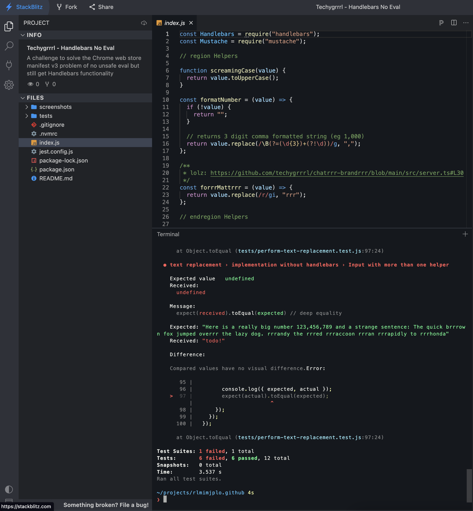
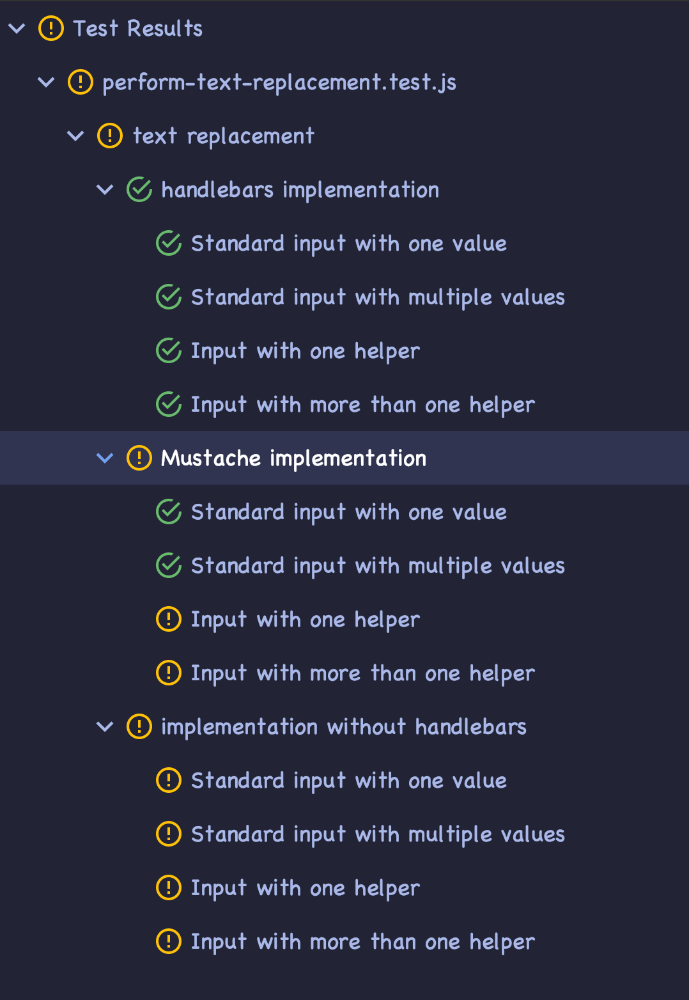
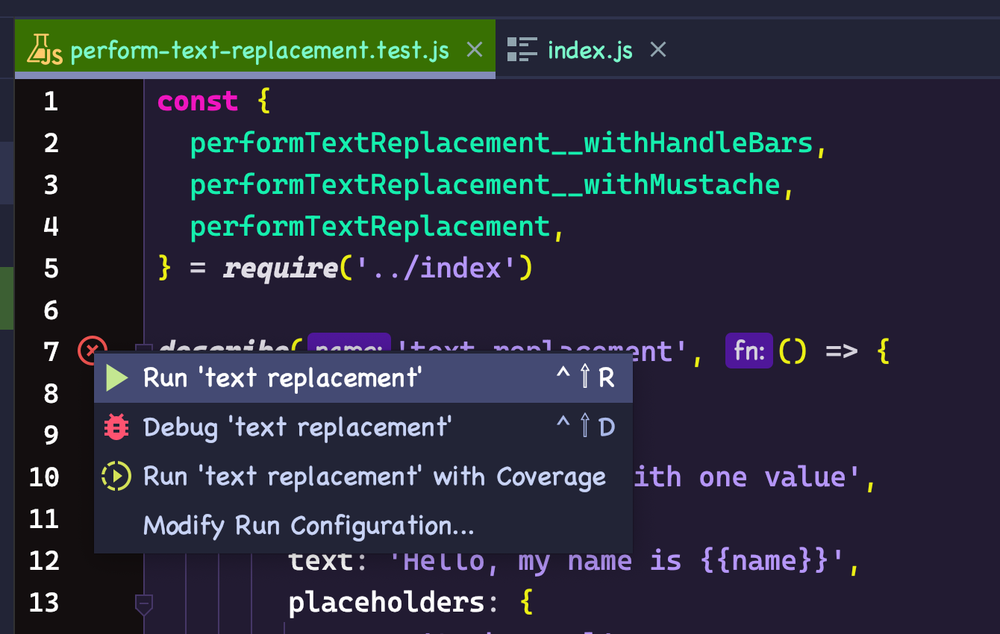

# Challenge: `eval-free` Handlebars replacement

The Chrome Web Store has a policy that manifest v3 Chrome extensions cannot include code that violates the content security policy (CSP) by including `unsafe-eval`. Using `eval` is not allowed for Chrome extensions.

The [mustache library](https://www.npmjs.com/package/mustache) does not use eval but it does not support helpers—by design, it boasts it is a "logic-free" solution.

- [Running locally](#running-locally)
- [Running on StackBlitz](#running-on-stackblitz)
- [About the tests](#about-the-tests)
- [Running the tests](#running-the-tests)
- [Constraints in more detail](#constraints-in-more-detail)

## Running locally

The project uses Node 16.x (see `.nvmrc`) but it will likely run on other versions but has not been tested for compatibility.

## Running on StackBlitz

If you do not have a Node.js environment set up, you can run it on StackBlitz:

After the `npm install` finishes you can run `npm test` in the console.

Screenshot of StackBlitz deploy

## About the tests

Below is a screenshot of the test runs in Webstorm. More information on how to run the tests below.

In the above screenshot:

- all the Handlebars tests pass
- some of the Mustache tests pass (the ones without helpers). The examples with helpers output blank in place of the mustache syntax.
- the custom implementation tests all fail (this is not implemented and where an alternative implementation can be provided)

## Running the tests

In order to run the tests, you'll need to install the dependencies:

    npm install

Then you can run the tests:

    npm test

You can also run the tests from inside of Webstorm by clicking the play button at the top-level `describe` block in the file `./tests/perform-text-replacement.test.js`.

## Constraints in more detail

The solution should allow implementing the provided helper functions.

You are allowed to use any library you can find, provided it does not use `eval`.

You are allowed to change the format of the input, e.g. if `{{formatNumber myNumber}}` is not preferred and you'd like to use an alternative format, e.g.
`{{formatNumber}}myNumber{{/formatNumber}}` that is ok too. If you do this, please copy the test cases and replace the input so that it uses your new syntax.

- **Hard constraint**: Cannot use eval
- **Soft constraint**: Avoid changing the helpers (e.g. leave `forrrMattrrr`, `formatNumber`, `screamingCase` as they are)

You do **not** need to add support for nested helpers, i.e. there is no need to perform `forrrMattrrr` and `screamingCase` on the same placeholder.